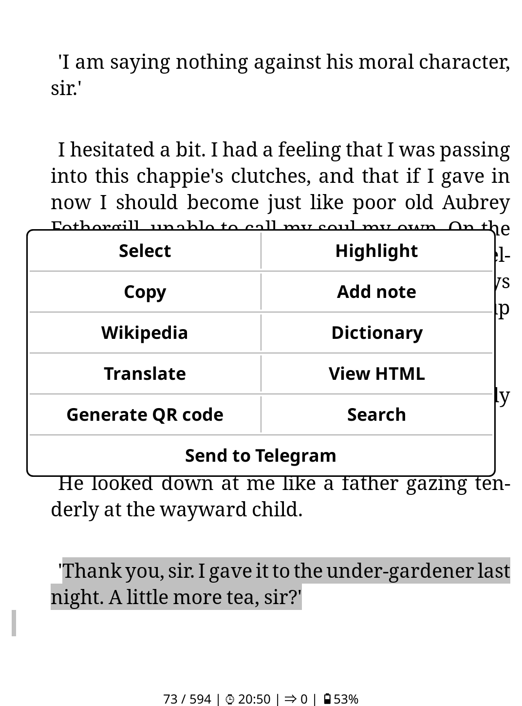
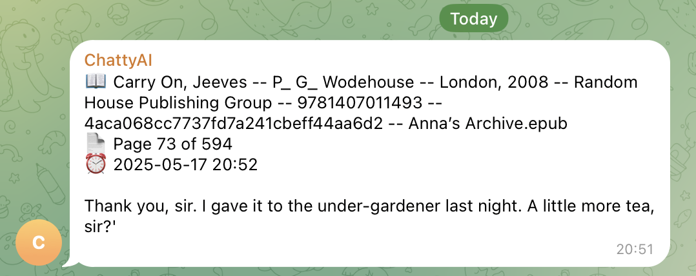

# koreader-highlightbot
A KOReader plugin that sends your text highlights directly to a Telegram chat using a bot. 
Perfect for archiving, sharing, or syncing reading notes from your Kindle or other eInk devices.

## ✨ Features

- One-tap sending of selected highlights
- Shows book title, chapter, page number, and timestamp
- Works directly from KOReader's highlight menu

---
## 📷 Demo


<table>
  <tr>
    <td><strong>KOReader Highlight Menu</strong></td>
  </tr>
  <tr>
    <td></td>
  </tr>
  <tr>
    <td><strong>Telegram Message</strong></td>
  </tr>
  <tr>
    <td></td>
  </tr>
</table>

---

## 🚀 Installation

1. **Download the plugin**

   Clone or download this repository and copy the folder `sendtelegram.koplugin` into `koreader/plugins/`

2. **Configure Telegram credentials**

    Then open config.lua in a text editor and fill in your Telegram bot token and chat ID.
    ```
    return {
        token = "123456:ABC-DEF1234ghIkl-zyx57W2v1u123ew11",  -- your bot token
        chat_id = "123456789"                                 -- your Telegram user or group chat ID
    }
    ``` 

3. **Restart KOReader**
    
    After completing the installation and configuration, restart KOReader.
    Then, go to the Plugins tab and make sure the plugin is enabled.


## 🤖 How to Get Your Bot & Chat ID

### 1. Create a Telegram Bot

- Open Telegram and start a chat with [@BotFather](https://t.me/BotFather)
- Send the command:  `/newbot`
- Follow the prompts to name your bot and set a username
- After setup, BotFather will give you a token
- Paste this token into your `config.lua`:

### 2. Get Your Chat ID

- Start a private chat with your bot by sending it any message
- Then open this URL in your browser `https://api.telegram.org/bot<token>/getUpdates
`(replace `token` with your actual token):
- You will see a JSON response. Look for a line like this: `"chat": { "id": 123456789, ... }`
- That id is your chat_id - copy it into your config.lua
